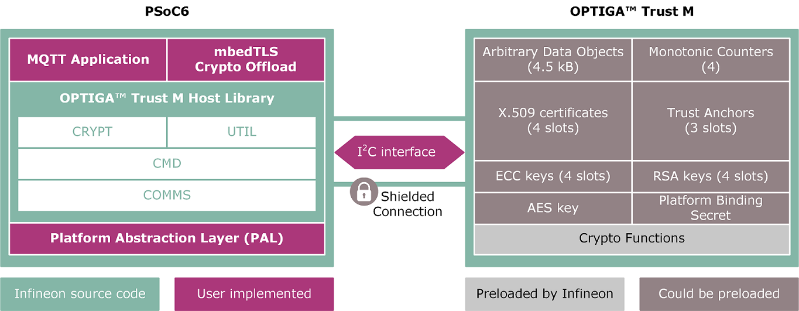

# OPTIGA&trade; Trust M: MQTT Client

This code example demonstrates the implementation of an MQTT Client using the [ModusToolbox&trade; MQTT Client library](https://github.com/Infineon/mqtt). The library uses the AWS IoT Device SDK MQTT Client library that includes an MQTT 3.1.1 Client and OPTIGA&trade; Trust M secure element.


**Figure 1. Connection between PSoC&trade; 6 host MCU and OPTIGA&trade; Trust M**




In this example, the MQTT Client RTOS task reads out a pre-provisioned X.509 certificate out of the secure element and populates the internal MQTT Client configuration to establish a connection with the configured MQTT Broker, and creates the following two tasks:

- **Publisher:** Publishes messages on a topic when the user button on the kit is pressed.

- **Subscriber:** Subscribes to the same topic and controls the user LED based on the messages received from the MQTT Broker.

If an unexpected MQTT or Wi-Fi disconnection occurs, the application executes a reconnection mechanism to restore the connection. In addition, all operations related to ECDSA and ECDHE that are performed as part of this demo, i.e., as part of the TLS channel establishment, are automatically accelerated on the secure element.

**Figure 2. Connection between an MQTT Client and an MQTT Server**


[View this README on GitHub.](https://github.com/Infineon/mtb-example-optiga-mqtt-client)

[Provide feedback on this code example.](https://cypress.co1.qualtrics.com/jfe/form/SV_1NTns53sK2yiljn?Q_EED=eyJVbmlxdWUgRG9jIElkIjoiQ0UyMzM3MzYiLCJTcGVjIE51bWJlciI6IjAwMi0zMzczNiIsIkRvYyBUaXRsZSI6Ik9QVElHQSZ0cmFkZTsgVHJ1c3QgTTogTVFUVCBDbGllbnQiLCJyaWQiOiJ5dXNoZXYiLCJEb2MgdmVyc2lvbiI6IjIuMC4wIiwiRG9jIExhbmd1YWdlIjoiRW5nbGlzaCIsIkRvYyBEaXZpc2lvbiI6Ik4vQSIsIkRvYyBCVSI6Ik4vQSIsIkRvYyBGYW1pbHkiOiJOL0EifQ==)


## Requirements

- [ModusToolbox&trade; software](https://www.infineon.com/modustoolbox) v3.0 or later (tested with v3.0)
- Board support package (BSP) minimum required version: 4.0.0
- Programming language: C

- Associated parts:
   - All [PSoC&trade; 6 MCU](https://www.infineon.com/PSoC6) parts with SDIO
   - [AIROC&trade; CYW43012 Wi-Fi & Bluetooth&trade; combo chip](https://www.infineon.com/cms/en/product/wireless-connectivity/airoc-wi-fi-plus-bluetooth-combos/wi-fi-4-802.11n/cyw43012/)
   - [AIROC&trade; CYW4343W Wi-Fi & Bluetooth&trade; combo chip](https://www.infineon.com/cms/en/product/wireless-connectivity/airoc-wi-fi-plus-bluetooth-combos/wi-fi-4-802.11n/cyw4343w/)
   - [OPTIGA&trade; Trust M security solution](https://www.infineon.com/cms/de/product/security-smart-card-solutions/optiga-embedded-security-solutions/optiga-trust/optiga-trust-m-sls32aia/)

**Note:** Before going through this example you might be also interested in the [ModusToolbox&trade; Training Level 3: WiFi](https://github.com/Infineon/training-modustoolbox-level3-wifi), which explains essential terms for the example, like: TLS, X.509 Certificates, Cloud and MQTT Protocol.  


## Supported toolchains (make variable 'TOOLCHAIN')

- GNU Arm&reg; embedded compiler v10.3.1 (`GCC_ARM`) - Default value of `TOOLCHAIN`
- Arm&reg; compiler v6.13 (`ARM`)
- IAR C/C++ compiler v8.42.2 (`IAR`)


## Supported kits (make variable 'TARGET')

- [OPTIGA&trade; Trust IoT security development kit](https://www.infineon.com/cms/en/product/evaluation-boards/optiga-trust-m-iot-kit/) (`CYSBSYSKIT-DEV-01`) - Default value of `TARGET`
- [PSoC&trade; 62S2 evaluation kit with the Sterling-LWB5+ M.2 radio module](https://www.infineon.com/cms/en/product/evaluation-boards/cy8ceval-062s2/) (`CY8CEVAL-062S2-LAI-4373M2`)
- To use this code example on a different hardware, please follow this [guidance](https://community.infineon.com/t5/Blogs/Interfacing-OPTIGA-Trust-M-with-a-PSoC-6-device/ba-p/361647)

## Hardware setup

This example uses the board's default configuration. See the kit user guide to ensure that the board is configured correctly.

## Software setup

Install a terminal emulator if you don't have one. Instructions in this document use [Tera Term](https://ttssh2.osdn.jp/index.html.en).

This code example implements a generic MQTT Client that can connect to various MQTT Brokers. In this document, the instructions to set up and run the MQTT Client have been provided for the AWS IoT MQTT Broker for reference.

This example requires no additional software or tools if you are using the MQTT Client with a publicly hosted MQTT Broker.


## Using the code example

> **WARNING:** Keep in mind that due to Windows [maximum path length limitation](https://docs.microsoft.com/en-us/windows/win32/fileio/maximum-file-path-limitation?tabs=registry), which is defined as 260 characters, the example might fail during build with an "No such file or directory" error due to many submodules added to the project. In such cases, shorten the system path of the project to a minimum; e.g., move it to a different location.

Create the project and open it using one of the following:

<details><summary><b>In Eclipse IDE for ModusToolbox&trade; software</b></summary>

1. Click the **New Application** link in the **Quick Panel** (or, use **File** > **New** > **ModusToolbox&trade; Application**). This launches the [Project Creator](https://www.infineon.com/ModusToolboxProjectCreator) tool.

2. Pick a kit supported by the code example from the list shown in the **Project Creator - Choose Board Support Package (BSP)** dialog.

   When you select a supported kit, the example is reconfigured automatically to work with the kit. To work with a different supported kit later, use the [Library Manager](https://www.infineon.com/ModusToolboxLibraryManager) to choose the BSP for the supported kit. You can use the Library Manager to select or update the BSP and firmware libraries used in this application. To access the Library Manager, click the link from the **Quick Panel**.

   You can also just start the application creation process again and select a different kit.

   If you want to use the application for a kit not listed here, you may need to update the source files. If the kit does not have the required resources, the application may not work.

3. In the **Project Creator - Select Application** dialog, choose the example by enabling the checkbox.

4. (Optional) Change the suggested **New Application Name**.

5. The **Application(s) Root Path** defaults to the Eclipse workspace which is usually the desired location for the application. If you want to store the application in a different location, you can change the *Application(s) Root Path* value. Applications that share libraries should be in the same root path.

6. Click **Create** to complete the application creation process.

For more details, see the [Eclipse IDE for ModusToolbox&trade; software user guide](https://www.infineon.com/MTBEclipseIDEUserGuide) (locally available at *{ModusToolbox&trade; software install directory}/ide_{version}/docs/mt_ide_user_guide.pdf*).

</details>

<details><summary><b>In command-line interface (CLI)</b></summary>

ModusToolbox&trade; software provides the Project Creator as both a GUI tool and the command line tool, "project-creator-cli". The CLI tool can be used to create applications from a CLI terminal or from within batch files or shell scripts. This tool is available in the *{ModusToolbox&trade; software install directory}/tools_{version}/project-creator/* directory.

Use a CLI terminal to invoke the "project-creator-cli" tool. On Windows, use the command line "modus-shell" program provided in the ModusToolbox&trade; software installation instead of a standard Windows command-line application. This shell provides access to all ModusToolbox&trade; software tools. You can access it by typing `modus-shell` in the search box in the Windows menu. In Linux and macOS, you can use any terminal application.

The "project-creator-cli" tool has the following arguments:

Argument | Description | Required/optional
---------|-------------|-----------
`--board-id` | Defined in the `<id>` field of the [BSP](https://github.com/Infineon?q=bsp-manifest&type=&language=&sort=) manifest | Required
`--app-id`   | Defined in the `<id>` field of the [CE](https://github.com/Infineon?q=ce-manifest&type=&language=&sort=) manifest | Required
`--target-dir`| Specify the directory in which the application is to be created if you prefer not to use the default current working directory | Optional
`--user-app-name`| Specify the name of the application if you prefer to have a name other than the example's default name | Optional

<br>

The following example clones the "[Hello world](https://github.com/Infineon/mtb-example-psoc6-hello-world)" application with the desired name "MyHelloWorld" configured for the *CYSBSYSKIT-DEV-01* BSP into the specified working directory, *C:/mtb_projects*:

   ```
   project-creator-cli --board-id CYSBSYSKIT-DEV-01 --app-id mtb-example-psoc6-hello-world --user-app-name MyHelloWorld --target-dir "C:/mtb_projects"
   ```

**Note:** The project-creator-cli tool uses the `git clone` and `make getlibs` commands to fetch the repository and import the required libraries. For details, see the "Project creator tools" section of the [ModusToolbox&trade; software user guide](https://www.infineon.com/ModusToolboxUserGuide) (locally available at *{ModusToolbox&trade; software install directory}/docs_{version}/mtb_user_guide.pdf*).

</details>

<details><summary><b>In third-party IDEs</b></summary>

Use one of the following options:

- **Use the standalone [Project Creator](https://www.infineon.com/ModusToolboxProjectCreator) tool:**

   1. Launch Project Creator from the Windows Start menu or from *{ModusToolbox&trade; software install directory}/tools_{version}/project-creator/project-creator.exe*.

   2. In the initial **Choose Board Support Package** screen, select the BSP, and click **Next**.

   3. In the **Select Application** screen, select the appropriate IDE from the **Target IDE** drop-down menu.

   4. Click **Create** and follow the instructions printed in the bottom pane to import or open the exported project in the respective IDE.

<br>

- **Use command-line interface (CLI):**

   1. Follow the instructions from the **In command-line interface (CLI)** section to create the application, and then import the libraries using the `make getlibs` command.

   2. Export the application to a supported IDE using the `make <ide>` command.

   3. Follow the instructions displayed in the terminal to create or import the application as an IDE project.

For a list of supported IDEs and more details, see the "Exporting to IDEs" section of the [ModusToolbox&trade; software user guide](https://www.infineon.com/ModusToolboxUserGuide) (locally available at *{ModusToolbox&trade; software install directory}/docs_{version}/mtb_user_guide.pdf*).

</details>


## Operation

+ [Step 1. Register your X.509 device certificate at AWS IoT](#step-1-register-your-x509-device-certificate-at-aws-iot)
+ [Step 2. Configure the application](#step-2-configure-the-application)
+ [Step 3. Program](#step-3-program)
+ [Alternative methods to verify the publish and subscribe functionality](#alternative-methods-to-verify-the-publish-and-subscribe-functionality)

### Step 1. Register your X.509 device certificate at AWS IoT

1. Set up the MQTT device (also known as a *Thing*) in the AWS IoT Core as described in the [Getting started with AWS IoT](https://docs.aws.amazon.com/iot/latest/developerguide/iot-gs.html) tutorial. Do not create a client certificate or a corresponding private key because they will be provided by the secure element.

    **Note:** While setting up your device, ensure that the policy associated with this device permits all MQTT operations (*iot:Connect*, *iot:Publish*, *iot:Receive*, and *iot:Subscribe*) for the resource used by this device. For testing purposes, it is recommended to have the following policy document which allows all *MQTT Policy Actions* on all *Amazon Resource Names (ARNs)*.
    ```
    {
        "Version": "2012-10-17",
        "Statement": [
            {
                "Effect": "Allow",
                "Action": "iot:*",
                "Resource": "*"
            }
        ]
    }
    ```
2. Download the device certificate from the CIRRENT&trade; Cloud ID as per instructions on the OPTIGA&trade; Trust IoT Security Development Kit package. On the **Device Management** tab, select **Cloud ID** > **Actions** > **Download the list of certificates**. A zip archive with a .CSV file inside with the following content is downloaded:

    - **Note:** If your board doesn't have a QR code to claim the device certificate, you can follow the "Step 3. Program" below and flash your board (even if it doesn't contain the correct configuration). You should be able to see your personal certificate extracted from the OPTIGA&trade; Trust M secure element which you can use as follows:

    ```
    "device_id","group_id","certificate"
    "d6c5a999890f44f843c34a9013e43c0372c59b14","D003",
    "-----BEGIN CERTIFICATE-----
    MIIC3DCCAcSgAwIBAgIU1sWpmYkPRPhDw0qQE+Q8A3LFmxQwDQYJKoZIhvcNAQEL
    BQAwHzELMAkGA1UEBhMCVVMxEDAOBgNVBAoTB2NpcnJlbnQwHhcNMjExMDEzMTkw
    NzE1WhcNMjIxMDEzMTkwNzE1WjAxMRAwDgYDVQQDEwdjaXJyZW50MQswCQYDVQQG
    EwJVUzEQMA4GA1UEChMHY2lycmVudDCCASIwDQYJKoZIhvcNAQEBBQADggEPADCC
    AQoCggEBAPShH3JuN7gs9Px/Gz9Hq4JsiJTS1O47i9QyLIDcMCOEF+HiXh4BsRyE
    7mqev8elqUDA8eKmWr4+CZgOJUmGyegGLCwdtyUyRadDQYvXawAMAF/ICJJdZ9JW
    w9C3yeXiyotRwfozamg4jsJ5gEFItDULmRQeCCamNIYBvIW6cP1X1CtlvABXFhqJ
    oBrtZ5PZrippGFBSI16e4ppcLuVrtW9E9wBcgPSNFv7fNaE9desFV3MNr69euC0a
    r2mSkcnJ9rU+dUMqyu3cyyfVHOTWPR3qGVGo3eLI4yFGJijsXiWaDB1i7F4+c0xn
    LQmy7JJsJP8sZQKXJOrjqK4aYx3h14UCAwEAATANBgkqhkiG9w0BAQsFAAOCAQEA
    dY/5WWFgN4fwHtLQwD3egymiGjd/oTZgFGJ8Ws879fUhsZczdjImOKvb9l3nmFoA
    HXL6QK/iSKaWeNfMJHb0Yvh5wU4yB1elB1yvO3k0r71q276m5Wxq37OHal9nXBfq
    7YdZYLDqzvNpsXmoOIw8UNFbcfD51ICfWCHGx/A8idip6YJjvF9qyYXbK0kzDIpE
    1wEgF2a/A82hBHVt/DSIdSI4tq00i46Ao6DbKelETR4l1I8J/7jjD82Sw82HtoKq
    L+706Bgupj11TRa0uCh8gXBXsmlaK/QQV4QOLo8M+yY6Njj6oUizb513IpkdFs2b
    x0M1J85xUZMOqXOs2nQWLQ==
    -----END CERTIFICATE-----
    "
    ```

3. Copy and paste the content starting from the `-----BEGIN CERTIFICATE-----` to `-----END CERTIFICATE-----` in a PEM file, and name it *certificate.pem*.

4. Register your *certificate.pem* file at your AWS IoT endpoint:

    1. In the navigation pane for the AWS IoT console, click **Secure**, and then click **Certificates**.

    2. On the **Certificates** page, click **Create a certificate**.

    3. Next to **Use my certificate**, click **Get started**.

    4. On the **Select a CA** page, leave the field blank, and then click **Next**.

       Multi-Account Registration does not require the user to register a certificate authority with AWS.

    5. On the **Register existing device certificates** page, click **Select certificates**, and then select the certificate that you recently saved (*certificate.pem*).

    6. Ensure that the **Activate All** option is selected, and then click **Register certificate**.

    7. Click **Actions** and then click **Attach policy** to attach the policy that you created. Then click **Attach**.

    8. Attach your certificate to the Thing you created earlier. On the **Certificates** page, select the certificate you just created.

    9. Click **Actions** and then click **Attach thing**.

    10. On the **Attach things to certificate(s)** window, select the Thing name and click **Attach**.


### Step 2. Configure the application

1. Set the Wi-Fi credentials in *configs/wifi_config.h* to Modify the user configuration files in the *configs* directory. Modify the macros `WIFI_SSID`, `WIFI_PASSWORD`, and `WIFI_SECURITY` to match with that of the Wi-Fi network that you want to connect to.

2. Navigate to the [AWS IoT console](https://console.aws.amazon.com). In the navigation pane, choose **Settings**.

    Your AWS IoT endpoint is displayed in **Endpoint**. It should look like `1234567890123-ats.iot.us-east-1.amazonaws.com`. Make a note of this endpoint.

3. In the *configs/mqtt_client_config.h* file, set `MQTT_BROKER_ADDRESS` and `MQTT_SNI_HOSTNAME` to your custom endpoint on the **Settings** page of the AWS IoT Console.

4. In the *configs/mqtt_client_config.h* file, set the following macros:

    - `MQTT_PORT`: Set to `8883`.
    - `MQTT_SECURE_CONNECTION`: Set to `1`.

5. Download the **Root CA "ECC 256 bit key** (Amazon Root CA 3) for AWS IoT from [CA certificates for server authentication](https://docs.aws.amazon.com/iot/latest/developerguide/server-authentication.html#server-authentication-certs).

    Note the following based on the TLS cipher suite:

    - *Based on ECDHE_ECDSA:* Select the [Amazon Root CA 3](https://www.amazontrust.com/repository/AmazonRootCA3.pem) (Default).

    - *Based on ECDHE_RSA:* Select another CA: [Amazon Root CA 1](https://www.amazontrust.com/repository/AmazonRootCA1.pem).

6. Using these certificates, enter the following parameters in *mqtt_client_config.h* in PEM format:

    - `ROOT_CA_CERTIFICATE` - Root CA certificate

       You can either convert the values to strings manually following the format shown in *mqtt_client_config.h* or you can use the HTML utility available [here](https://github.com/Infineon/amazon-freertos/blob/master/tools/certificate_configuration/PEMfileToCString.html) to convert the certificates and keys from PEM format to C string format. You need to clone the repository from GitHub to use the utility.

       For a full list of configuration macros used in this code example, see [Wi-Fi and MQTT configuration macros](#wi-fi-and-mqtt-configuration-macros).

7. *(Optional)* Modify the configuration macros in the following files according to your application:

    - *configs/core_mqtt_config.h* used by the [MQTT library](https://github.com/Infineon/mqtt)

    - *configs/FreeRTOSConfig.h* used by the [FreeRTOS library](https://github.com/Infineon/freertos)


### Step 3. Program

1. Connect the board to your PC using the provided USB cable through the KitProg3 USB connector.

2. Program the board using one of the following (you don't need any extra configuration for the first part):

    <details><summary><b>Using Eclipse IDE for ModusToolbox&trade;</b></summary>

    1. Select the application project in the Project Explorer.

    2. In the **Quick Panel**, scroll down, and click **\<Application Name> Program (KitProg3_MiniProg4)**.

    </details>

    <details><summary><b>Using CLI</b></summary>

    From the terminal, execute the `make program` command to build and program the application using the default toolchain to the default target. You can specify a target and toolchain manually:
    ```
    make program TARGET=<BSP> TOOLCHAIN=<toolchain>
    ```

    Example:
    ```
    make program TARGET=CYSBSYSKIT-DEV-01 TOOLCHAIN=GCC_ARM
    ```
    </details>

3. After programming, the application starts automatically. Observe the messages on the UART terminal, and wait for the device to make all the required connections.

   **Figure 3. Application initialization status**

   


4. Confirm that the following message is printed on the UART terminal:

    ```
    Press the user button (SW2) to publish "TURN ON"/"TURN OFF" on the topic 'ledstatus'...
    ```
    This message may vary depending on the MQTT topic and publish messages that are configured in the *mqtt_client_config.h* file.

5. Press the user button (SW2) on the kit to toggle the LED state.

6. Confirm that the user LED state is toggled and the messages received on the subscribed topic are printed on the UART terminal.

   **Figure 4. Publisher and subscriber logs**

   

This example can be programmed on multiple kits (*Only when `GENERATE_UNIQUE_CLIENT_ID` is set to `1`*); the user LEDs on all the kits will synchronously toggle with a button press on any kit.

### Alternative methods to verify the publish and subscribe functionality

You can individually verify the publish and subscribe functionalities of the MQTT Client if the MQTT Broker supports a Test MQTT Client such as AWS IoT.

- **To verify the subscribe functionality:** Using the Test MQTT Client, publish messages such as "TURN ON" and "TURN OFF" on the topic specified by the `MQTT_PUB_TOPIC` macro in *mqtt_client_config.h* to control the LED state on the kit.

- **To verify the publish functionality:** From the Test MQTT Client, subscribe to the MQTT topic specified by the `MQTT_SUB_TOPIC` macro and confirm that the messages published by the kit (when the user button is pressed) are displayed on the Test MQTT Client's console.


## Debugging

You can debug the example to step through the code. In the IDE, use the **\<Application Name> Debug (KitProg3_MiniProg4)** configuration in the **Quick Panel**. For details, see the "Program and debug" section in the [Eclipse IDE for ModusToolbox&trade; software user guide](https://www.infineon.com/MTBEclipseIDEUserGuide).

**Note:** **(Only while debugging)** On the CM4 CPU, some code in `main()` may execute before the debugger halts at the beginning of `main()`. This means that some code executes twice – once before the debugger stops execution, and again after the debugger resets the program counter to the beginning of `main()`. See [KBA231071](https://community.infineon.com/docs/DOC-21143) to learn about this and for the workaround.


## Design and implementation

This example implements the following RTOS tasks:

- OPTIGA&trade; Trust
- MQTT Client
- MQTT Publisher
- MQTT Subscriber

The main function initializes the BSP and the retarget-io library, and creates the OPTIGA&trade; Trust task.

The OPTIGA&trade; Trust task does the following:

1. Initializes the secure element

2. Extracts the pre-provisioned public key certificate from the chip

3. Populates the public key certificate with the internal configuration for secure communication

4. Initializes the MQTT Client task

The MQTT Client task does the following:

1. Initializes the Wi-Fi Connection Manager (WCM) and connects to a Wi-Fi access point (AP) using the Wi-Fi network credentials that are configured in *wifi_config.h*

2. Upon a successful Wi-Fi connection, initializes the MQTT library and establishes a connection with the MQTT Broker/Server

The MQTT connection is configured to be secure by default; the secure connection requires a client certificate, a private key, and the Root CA certificate of the MQTT Broker that are configured in *mqtt_client_config.h*.

After a successful MQTT connection, the Subscriber and Publisher tasks are created. The MQTT Client task then waits for commands from the other two tasks and callbacks to handle events such as unexpected disconnections.

The Subscriber task initializes the user LED GPIO and subscribes to messages on the topic specified by the `MQTT_SUB_TOPIC` macro that are configured in *mqtt_client_config.h*. When the Subscriber task receives a message from the Broker, it turns the user LED ON or OFF depending on whether the received message is "TURN ON" or "TURN OFF" (configured using the `MQTT_DEVICE_ON_MESSAGE` and `MQTT_DEVICE_OFF_MESSAGE` macros).

The Publisher task sets up the user button GPIO and configures an interrupt for the button. The ISR notifies the Publisher task when a button press is detected. The Publisher task then publishes messages (*TURN ON* / *TURN OFF*) on the topic specified by the `MQTT_PUB_TOPIC` macro. When the publish operation fails, a message is sent over a queue to the MQTT Client task.

An MQTT event callback function `mqtt_event_callback()` is invoked by the MQTT library for events such as MQTT disconnection and incoming MQTT subscription messages from the MQTT Broker. In the case of an MQTT disconnection, the MQTT Client task is informed about the disconnection using a message queue. When an MQTT subscription message is received, the subscriber callback function implemented in *subscriber_task.c* is invoked to handle the incoming MQTT message.

The MQTT Client task handles unexpected disconnections in the MQTT or Wi-Fi connections by initiating reconnection to restore the Wi-Fi and MQTT connections. Upon failure, the Publisher and Subscriber tasks are deleted, cleanup operations of various libraries are performed, and then the MQTT client task is terminated.

### Sequence of operation

1. The user button is pressed.

2. The GPIO interrupt service routine (ISR) notifies the Publisher task.

3. The Publisher task publishes a message on a topic.

4. The MQTT Broker sends back the message to the MQTT Client because it is also subscribed to the same topic.

5. When the message is received, the Subscriber task turns the LED ON or OFF. As a result, the user LED toggles every time the user presses the button.


## Enabling the OPTIGA&trade; Trust library

+ [Configuration](#configuration)
    - [I2C Pins](#i2c-pins)
    - [Reset and power control pins](#reset-and-power-control-pins)
    - [Initialization in a FreeRTOS task](#initialization-in-a-freertos-task)
    - [Certificate extraction and MQTT connection configuration](#certificate-extraction-and-mqtt-connection-configuration)
    - [mbed TLS configuration](#mbed-tls-configuration)
    - [Cryptography (ECDSA, ECDHE, Random) functions call routing](#cryptography--ecdsa--ecdhe--random--functions-call-routing)
    - [Custom Certificates and Keys](#custom-certificates-and-keys)
+ [Configuring the MQTT Client](#configuring-the-mqtt-client)
    - [Wi-Fi and MQTT configuration macros](#wi-fi-and-mqtt-configuration-macros)
+ [Resources and settings](#resources-and-settings)

### Configuration

#### I2C Pins

Supported boards have `CYBSP_I2C_SCL_OPTIGA` and `CYBSP_I2C_SDA_OPTIGA` defined in their BSP. Alternatively, you can define these in the [optiga_lib_mtb_config.h](source/optiga_lib_config_mtb.h#L161-L162) file.

#### Reset and power control pins

The OPTIGA&trade; Trust secure element can be controlled via a dedicated reset and a power control line. For example, the power control line is used for entering hibernate mode on the chip.

Do the following:

1. Define `OPTIGA_TRUSTM_VDD` and `OPTIGA_TRUSTM_RST` with the corresponding GPIOs in your *optiga_lib_config_mtb.h* file.

2. Change the reset type (`OPTIGA_COMMS_DEFAULT_RESET_TYPE`) as appropriate:

   - If both macros are defined: Set this value to `0`.

   - If only the reset line is connected: Set this value to `2`.


#### Initialization in a FreeRTOS task

If the [Makefile](Makefile#L81) defines `PSOC_FREERTOS`, it means that the OPTIGA&trade; Trust library uses a FreeRTOS-based Platform Abstraction Layer (PAL) for the communication. In this case, adhere to the following guidelines:

1. Always initialize the secure element from a task.

2. Allocate enough stack (not more than 3072 bytes) to the OPTIGA&trade; Trust task, depending on the configuration it needs.

3. Do not start any MQTT-related tasks before the secure element is initialized.


#### Certificate extraction and MQTT connection configuration

Immediately after the secure element is initialized, you might need to extract the certificate from the chip and assign it to the internal MQTT Client configuration. For an example, see [here](source/mqtt_client_config.c#L171).


#### mbed TLS configuration

For a successful TLS communication, make sure that only supported handshake methods are selected in your mbed TLS configuration file.

To do this, do **one** of the following:

-  *Undefine* the following:
   - `MBEDTLS_KEY_EXCHANGE_DHE_PSK_ENABLED`
   - `MBEDTLS_KEY_EXCHANGE_ECDHE_PSK_ENABLED`
   - `MBEDTLS_KEY_EXCHANGE_RSA_PSK_ENABLED`
   - `MBEDTLS_KEY_EXCHANGE_RSA_ENABLED`
   - `MBEDTLS_KEY_EXCHANGE_DHE_RSA_ENABLED`
   - `MBEDTLS_KEY_EXCHANGE_ECDH_RSA_ENABLED`
   - `MBEDTLS_KEY_EXCHANGE_ECDHE_RSA_ENABLED`

- *Define* the following:
   - `MBEDTLS_KEY_EXCHANGE_ECDHE_ECDSA_ENABLED`

If Wi-Fi online provisioning is used, your example will try to establish a connection with several clouds. This restricts the use of many handshake methods. For example, the `MBEDTLS_KEY_EXCHANGE_ECDHE_ECDSA_ENABLED` method might be not available. You can choose the `MBEDTLS_KEY_EXCHANGE_ECDHE_RSA_ENABLED` and change the Root CA configuration (`ROOT_CA_CERTIFICATE`) to use the Amazon Root CA 1 (based on RSA 2048), instead of the default value of Amazon Root CA 3 (based on ECC 256).

#### Cryptography (ECDSA, ECDHE, Random) functions call routing

Ensure that your mbed TLS configuration file has the following macros defined:

- `MBEDTLS_ECDH_GEN_PUBLIC_ALT`
- `MBEDTLS_ECDSA_SIGN_ALT`
- `MBEDTLS_ECDSA_VERIFY_ALT`
- `MBEDTLS_ECDH_COMPUTE_SHARED_ALT`
- `MBEDTLS_ECDSA_GENKEY_ALT`

In addition to these macros, ensure that your build includes the *$(optiga-trust-m)/examples/mbedtls_port* files.

#### Custom Certificates and Keys

If you don't have your own credentials for the connection, but you would like to generate them, refer to the [OPTIGA&trade; Trust M: Data and certificates management](https://github.com/Infineon/mtb-example-optiga-data-management) Code Example.
If you would like to use existing credentials and would like to change default Object IDs, edit the Makefile and add to the `DEFINES` the following macros:

- `LABEL_DEVICE_PRIVATE_KEY_FOR_TLS='"0xE0F1"'` to define a private key slot of the PKCS11 Engine (secure-sockets middleware library), where `'"0xE0F1"'` value can be of your choice.
- `CONFIG_OPTIGA_TRUST_M_PRIVKEY_SLOT=0xE0F1` to define the private key slot of the mbedtls alternative implementation, where `0xe0F1` is the same value as specified above. Keep in mind, that here no additional signs `'"` are required
- `LABEL_DEVICE_CERTIFICATE_FOR_TLS='"0xE0E1"'` to define a matching certificate to the private key mentioned above of the PKCS11 Engine, where `'"0xE0E1"'` value can be of your choice.


### Configuring the MQTT Client

#### Wi-Fi and MQTT configuration macros

| Macro                     |  Description              |
| :-------------------------| :------------------------ |
| **Wi-Fi connection configuration**  |  In *configs/wifi_config.h*  |
| `WIFI_SSID`       | SSID of the Wi-Fi AP to which the MQTT Client connects   |
| `WIFI_PASSWORD`   | Passkey/password for the Wi-Fi SSID specified above                 |
| `WIFI_SECURITY`   | Security type of the Wi-Fi AP. See the `cy_wcm_security_t` structure in the *cy_wcm.h* file for more details.      |
| `MAX_WIFI_CONN_RETRIES`   | Maximum number of retries for the Wi-Fi connection   |
| `WIFI_CONN_RETRY_INTERVAL_MS`   | Time interval in milliseconds in between successive Wi-Fi connection retries   |
| **MQTT connection configurations**  |  In *configs/mqtt_client_config.h*  |
| `MQTT_BROKER_ADDRESS`      | Hostname of the MQTT Broker        |
| `MQTT_PORT`                | Port number to be used for the MQTT connection. As specified by the Internet Assigned Numbers Authority (IANA), port numbers assigned for the MQTT protocol are *1883* for non-secure connections and *8883* for secure connections. However, MQTT Brokers may use other ports. Configure this macro as specified by the MQTT Broker.                      |
| `MQTT_SECURE_CONNECTION`   | Set this macro to `1` if your application requires establishing a secure (TLS) connection to the MQTT Broker; else `0`.         |
| `MQTT_USERNAME` <br> `MQTT_PASSWORD`   | User name and password for client authentication and authorization, if required by the MQTT Broker. However, note that this information is generally not encrypted and the password is sent in plain text. Therefore, this is not a recommended method of client authentication. |
| **MQTT Client certificate configurations**  |  In *configs/mqtt_client_config.h*  |
| `CLIENT_CERTIFICATE` <br> `CLIENT_PRIVATE_KEY`  | Certificate and private key of the MQTT Client used for client authentication. Note that these macros are applicable only when `MQTT_SECURE_CONNECTION` is set to `1`.      |
| `ROOT_CA_CERTIFICATE`      |  Root CA certificate of the MQTT Broker |
| **MQTT message configurations**    |  In *configs/mqtt_client_config.h*  |
| `MQTT_PUB_TOPIC`           | MQTT topic to which the messages are published by the Publisher task to the MQTT Broker    |
| `MQTT_SUB_TOPIC`           | MQTT topic to which the Subscriber task subscribes. The MQTT Broker sends the messages to the Subscriber that are published in this topic (or equivalent topic).  |
| `MQTT_MESSAGES_QOS`        | Quality of Service (QoS) level to be used by the Publisher and Subscriber. Valid choices are `0`, `1`, and `2`.  |
| `ENABLE_LWT_MESSAGE`       | Set this macro to `1` if you want to use the 'Last Will and Testament (LWT)' option; else `0`. LWT is an MQTT message that will be published by the MQTT Broker on the specified topic if the MQTT connection is unexpectedly closed. This configuration is sent to the MQTT Broker during MQTT connect operation; the MQTT Broker will publish the Will message on the Will topic when it recognizes an unexpected disconnection from the client. |
| `MQTT_WILL_TOPIC_NAME` <br> `MQTT_WILL_MESSAGE`   | MQTT topic and message for the LWT option described above. These configurations are applicable only when `ENABLE_LWT_MESSAGE` is set to `1`.  |
| `MQTT_DEVICE_ON_MESSAGE` <br> `MQTT_DEVICE_OFF_MESSAGE`  | MQTT messages that control the device (LED) state in this code example  |
| **Other MQTT Client configurations**    |  In *configs/mqtt_client_config.h*  |
| `GENERATE_UNIQUE_CLIENT_ID`   | Every active MQTT connection must have a unique client identifier. If this macro is set to `1`, the device will generate a unique client identifier by appending a timestamp to the string specified by the `MQTT_CLIENT_IDENTIFIER` macro. This feature is useful if you are using the same code on multiple kits simultaneously.   |
| `MQTT_CLIENT_IDENTIFIER`     | Client identifier (client ID) string to be used during an MQTT connection. If `GENERATE_UNIQUE_CLIENT_ID` is set to `1`, a timestamp is appended to this macro value and used as the client ID; else, the value specified for this macro is directly used as the client ID.   |
| `MQTT_CLIENT_IDENTIFIER_MAX_LEN`   | The longest client identifier that an MQTT Server must accept (as defined by the MQTT 3.1.1 spec) is 23 characters. However, some MQTT Brokers support longer client IDs. Configure this macro as per the MQTT Broker specification.  |
| `MQTT_TIMEOUT_MS`            | Timeout in milliseconds for MQTT operations in this example   |
| `MQTT_KEEP_ALIVE_SECONDS`    | Keep a live interval in seconds used for the MQTT ping request   |
| `MQTT_ALPN_PROTOCOL_NAME`   | Application Layer Protocol Negotiation (ALPN) protocol name to be used that is supported by the MQTT Broker in use. Note that this is an optional macro for most of the use cases. <br>Per IANA, the port numbers assigned for the MQTT protocol are 1883 for non-secure connections and 8883 for secure connections. Some applications may need to use other ports for MQTT such as port 443 (which is reserved for HTTPS). ALPN is an extension for TLS that allows many protocols to be used over a secure connection.     |
| `MQTT_SNI_HOSTNAME`   | Server Name Indication (SNI) host name to be used during a TLS connection as specified by the MQTT Broker. <br>SNI is an extension to the TLS protocol. As required by some MQTT Brokers, SNI typically includes the hostname in the "Client Hello" message sent during a TLS handshake.     |
| `MQTT_NETWORK_BUFFER_SIZE`   | Size of the network buffer  allocated for sending and receiving MQTT packets over the network. Note that the minimum buffer size is defined by the `CY_MQTT_MIN_NETWORK_BUFFER_SIZE` macro in the MQTT library.  |
| `MAX_MQTT_CONN_RETRIES`   | Maximum number of retries for an MQTT connection   |
| `MQTT_CONN_RETRY_INTERVAL_MS`   | Time interval in milliseconds in between successive MQTT connection retries   |


### Resources and settings

**Table 1. Application resources**

| Resource  |  Alias/Object     |    Purpose     |
| :------- | :------------    | :------------ |
| UART (HAL)|cy_retarget_io_uart_obj| UART HAL object used by Retarget-IO for Debug UART port  |
| GPIO (HAL)    | CYBSP_USER_LED         | User LED controlled by the Subscriber based on incoming MQTT messages  |
| GPIO (HAL)    | CYBSP_USER_BTN         | User button used to notify the Publisher to publish MQTT messages |


Add `MBEDTLS_VERBOSE=4` and `ENABLE_SECURE_SOCKETS_LOGS` in the Makefile to the end of the `DEFINES` list after a whitespace to enable an verbose output of mbedtls in case you have a problem during the TLS channel establishment, the Makefile content should be then similar to the following:

```
DEFINES=$(MBEDTLSFLAGS) $(OPTIGAFLAGS) CYBSP_WIFI_CAPABLE CY_RETARGET_IO_CONVERT_LF_TO_CRLF CY_CRYPTO_HAL_DISABLE MBEDTLS_VERBOSE=4
```


## Related resources

Resources | Links
----------|------
Application notes |[AN228571](https://www.infineon.com/dgdl/Infineon-AN228571_Getting_started_with_PSoC_6_MCU_on_ModusToolbox_software-ApplicationNotes-v06_00-EN.pdf?fileId=8ac78c8c7cdc391c017d0d36de1f66d1) – Getting started with PSoC&trade; 6 MCU on ModusToolbox&trade; software <br> [AN215656](https://www.infineon.com/dgdl/Infineon-AN215656_PSoC_6_MCU_Dual-CPU_System_Design-ApplicationNotes-v09_00-EN.pdf?fileId=8ac78c8c7cdc391c017d0d3180c4655f) – PSoC&trade; 6 MCU: Dual-CPU system design
Code examples on GitHub| [Using ModusToolbox&trade; software](https://github.com/Infineon/Code-Examples-for-ModusToolbox-Software)
Device documentation | [PSoC&trade; 6 MCU datasheets](https://www.infineon.com/dgdl/Infineon-PSoC_6_MCU_CY8C62x6_CY8C62x7-DataSheet-v14_00-EN.pdf?fileId=8ac78c8c7d0d8da4017d0ee4c9386bff) <br> [PSoC&trade; 6 technical reference manuals](https://www.infineon.com/dgdl/Infineon-PSoC_6_MCU_PSoC_62_Architecture_Technical_Reference_Manual-AdditionalTechnicalInformation-v08_00-EN.pdf?fileId=8ac78c8c7d0d8da4017d0f94758401d1) <br> [OPTIGA&trade; Trust M datasheet](https://www.infineon.com/cms/en/product/security-smart-card-solutions/optiga-embedded-security-solutions/optiga-trust/optiga-trust-m-sls32aia/#!?fileId=5546d4626c1f3dc3016c853c271a7e4a)
Development kits | Select your kits from the [Evaluation Board Finder](https://www.infineon.com/cms/en/design-support/finder-selection-tools/product-finder/evaluation-board) page.
Libraries on GitHub  | [mtb-pdl-cat1](https://github.com/Infineon/mtb-pdl-cat1) – PSoC&trade; 6 peripheral driver library (PDL)  <br> [mtb-hal-cat1](https://github.com/Infineon/mtb-hal-cat1) – Hardware abstraction layer (HAL) library <br> [retarget-io](https://github.com/Infineon/retarget-io) – Utility library to retarget STDIO messages to a UART port
Middleware on GitHub  | [optiga-trust-m](https://github.com/Infineon/optiga-trust-m) – OPTIGA&trade; Trust M library and documents <br> [capsense](https://github.com/Infineon/capsense) – CAPSENSE&trade; library and documents <br> [psoc6-middleware](https://github.com/Infineon/modustoolbox-software#psoc-6-middleware-libraries) – Links to all PSoC&trade; 6 MCU middleware
Tools  | [Eclipse IDE for ModusToolbox&trade; software](https://www.infineon.com/cms/en/design-support/tools/sdk/modustoolbox-software) – ModusToolbox&trade; software is a collection of easy-to-use software and tools enabling rapid development with Infineon MCUs, covering applications from embedded sense and control to wireless and cloud-connected systems using AIROC&trade; Wi-Fi and Bluetooth® connectivity devices.


<br>

## Other resources

Infineon provides a wealth of data at www.infineon.com to help you select the right device, and quickly and effectively integrate it into your design.

For PSoC&trade; 6 MCU devices, see [How to design with PSoC&trade; 6 MCU – KBA223067](https://community.infineon.com/docs/DOC-14644) in the Infineon Developer Community.

## Document history

Document title: *CE233736* – *OPTIGA&trade; Trust M: MQTT Client*

| Version | Description of change                          |
| ------- | ---------------------------------------------- |
| 1.0.0   | New code example                               |
| 1.1.0   | Fix 62S2 boards build and minor README updates |
| 2.0.0   | Major update to support ModusToolbox&trade; v3.0. This version is not backward compatible with previous versions of ModusToolbox&trade; |
------

All other trademarks or registered trademarks referenced herein are the property of their respective owners.

-----------------

© Cypress Semiconductor Corporation, 2023. This document is the property of Cypress Semiconductor Corporation, an Infineon Technologies company, and its affiliates ("Cypress").  This document, including any software or firmware included or referenced in this document ("Software"), is owned by Cypress under the intellectual property laws and treaties of the United States and other countries worldwide.  Cypress reserves all rights under such laws and treaties and does not, except as specifically stated in this paragraph, grant any license under its patents, copyrights, trademarks, or other intellectual property rights.  If the Software is not accompanied by a license agreement and you do not otherwise have a written agreement with Cypress governing the use of the Software, then Cypress hereby grants you a personal, non-exclusive, nontransferable license (without the right to sublicense) (1) under its copyright rights in the Software (a) for Software provided in source code form, to modify and reproduce the Software solely for use with Cypress hardware products, only internally within your organization, and (b) to distribute the Software in binary code form externally to end users (either directly or indirectly through resellers and distributors), solely for use on Cypress hardware product units, and (2) under those claims of Cypress’s patents that are infringed by the Software (as provided by Cypress, unmodified) to make, use, distribute, and import the Software solely for use with Cypress hardware products.  Any other use, reproduction, modification, translation, or compilation of the Software is prohibited.
<br>
TO THE EXTENT PERMITTED BY APPLICABLE LAW, CYPRESS MAKES NO WARRANTY OF ANY KIND, EXPRESS OR IMPLIED, WITH REGARD TO THIS DOCUMENT OR ANY SOFTWARE OR ACCOMPANYING HARDWARE, INCLUDING, BUT NOT LIMITED TO, THE IMPLIED WARRANTIES OF MERCHANTABILITY AND FITNESS FOR A PARTICULAR PURPOSE.  No computing device can be absolutely secure.  Therefore, despite security measures implemented in Cypress hardware or software products, Cypress shall have no liability arising out of any security breach, such as unauthorized access to or use of a Cypress product.  CYPRESS DOES NOT REPRESENT, WARRANT, OR GUARANTEE THAT CYPRESS PRODUCTS, OR SYSTEMS CREATED USING CYPRESS PRODUCTS, WILL BE FREE FROM CORRUPTION, ATTACK, VIRUSES, INTERFERENCE, HACKING, DATA LOSS OR THEFT, OR OTHER SECURITY INTRUSION (collectively, "Security Breach").  Cypress disclaims any liability relating to any Security Breach, and you shall and hereby do release Cypress from any claim, damage, or other liability arising from any Security Breach.  In addition, the products described in these materials may contain design defects or errors known as errata which may cause the product to deviate from published specifications.  To the extent permitted by applicable law, Cypress reserves the right to make changes to this document without further notice. Cypress does not assume any liability arising out of the application or use of any product or circuit described in this document.  Any information provided in this document, including any sample design information or programming code, is provided only for reference purposes.  It is the responsibility of the user of this document to properly design, program, and test the functionality and safety of any application made of this information and any resulting product.  "High-Risk Device" means any device or system whose failure could cause personal injury, death, or property damage.  Examples of High-Risk Devices are weapons, nuclear installations, surgical implants, and other medical devices.  "Critical Component" means any component of a High-Risk Device whose failure to perform can be reasonably expected to cause, directly or indirectly, the failure of the High-Risk Device, or to affect its safety or effectiveness.  Cypress is not liable, in whole or in part, and you shall and hereby do release Cypress from any claim, damage, or other liability arising from any use of a Cypress product as a Critical Component in a High-Risk Device.  You shall indemnify and hold Cypress, including its affiliates, and its directors, officers, employees, agents, distributors, and assigns harmless from and against all claims, costs, damages, and expenses, arising out of any claim, including claims for product liability, personal injury or death, or property damage arising from any use of a Cypress product as a Critical Component in a High-Risk Device.  Cypress products are not intended or authorized for use as a Critical Component in any High-Risk Device except to the limited extent that (i) Cypress’s published data sheet for the product explicitly states Cypress has qualified the product for use in a specific High-Risk Device, or (ii) Cypress has given you advance written authorization to use the product as a Critical Component in the specific High-Risk Device and you have signed a separate indemnification agreement.
<br>
Cypress, the Cypress logo, and combinations thereof, WICED, ModusToolBox, PSoC, CapSense, EZ-USB, F-RAM, and Traveo are trademarks or registered trademarks of Cypress or a subsidiary of Cypress in the United States or in other countries.  For a more complete list of Cypress trademarks, visit cypress.com.  Other names and brands may be claimed as property of their respective owners.
